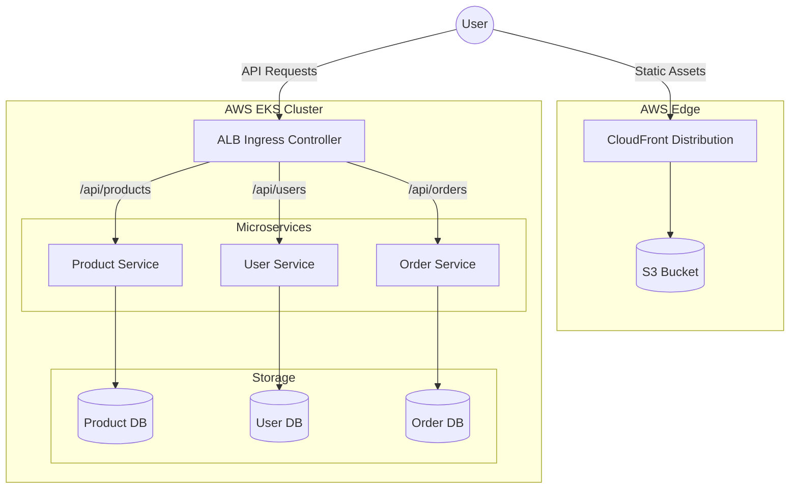

# System Architecture

CloudMart is a modern e-commerce platform built using a microservices architecture. It is designed to be highly available, scalable, and fully automated using DevOps and GitOps best practices.

## High-Level Architecture Flow

The system is logically divided into three main layers:
1. **Edge / CDN Layer**: Serves the static frontend application directly to users.
2. **API Gateway / Ingress Layer**: Routes backend traffic to the appropriate microservices.
3. **Microservices / Data Layer**: Core business logic and persistence.

## Frontend Architecture

The frontend is a **React + Vite** single-page application (SPA). 
To optimize for performance and cost, the frontend is completely decoupled from the Kubernetes cluster.
- **Hosting**: AWS S3 Bucket (Private)
- **CDN**: AWS CloudFront (Provides edge caching, SSL via ACM, and Origin Access Control to securely fetch from S3).
- **Routing**: CloudFront handles SPA routing by redirecting 404/403 errors back to `index.html`.

## Microservices Breakdown

The backend consists of three independent **Node.js + Express** microservices. Each service follows the Database-per-service pattern, ensuring loose coupling.

### 1. Product Service
- **Port**: 3000
- **Database**: PostgreSQL (`productdb`)
- **Endpoints**:
  - `GET /api/products`
  - `POST /api/products`

### 2. User Service
- **Port**: 3001
- **Database**: PostgreSQL (`userdb`)
- **Endpoints**:
  - `GET /api/users`
  - `POST /api/users`

### 3. Order Service
- **Port**: 3002
- **Database**: PostgreSQL (`orderdb`)
- **Endpoints**:
  - `GET /api/orders`
  - `POST /api/orders`

### Service Resilience
Each microservice is designed for containerized orchestration:
- **Environment Variables**: Completely configured via environment variables (12-factor app).
- **Retry Logic**: Includes exponential backoff for database connections on startup, preventing crash-loops if the database container takes longer to start.
- **Health Probes**: Exposes a `/health` endpoint that checks both process viability and database connectivity. This is used by Kubernetes Liveness and Readiness probes.
- **Structured Logging**: Outputs JSON formatted logs for easy ingestion by Fluent-bit.
