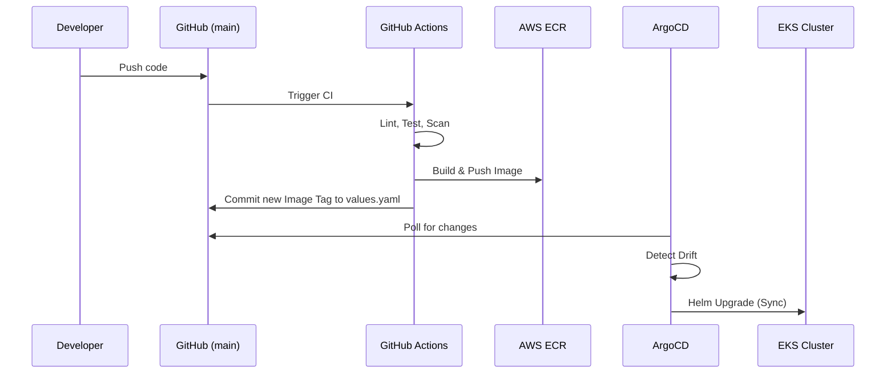

# Deployment & CI/CD

CloudMart employs a modern GitOps-based deployment strategy. We treat the Git repository as the single source of truth for both application code and infrastructure state.

## Continuous Integration (GitHub Actions)

The CI/CD pipeline is defined in `.github/workflows/ci-cd.yml` and triggers automatically on pushes to the `main` branch.

### Pipeline Stages:
1. **Checkout & Setup**: Fetches the code and sets up Node.js.
2. **Linting & Testing**: Validates the codebase (`npm ci`, `npm run lint`, `npm test`).
3. **Container Build**: Builds the Docker images for the modified microservices using a Matrix strategy.
4. **Security Scanning (Trivy)**: Scans the freshly built local images for critical and high vulnerabilities.
5. **Publish to ECR**: Uses OIDC (OpenID Connect) to securely authenticate with AWS and push the images to Elastic Container Registry.
6. **Frontend Deployment**: If the frontend changed, the pipeline builds the Vite artifacts (`npm run build`), syncs the `dist/` directory directly to the S3 bucket, and creates a CloudFront invalidation for immediate edge propagation.
7. **GitOps Commit**: Automatically modifies the `helm/cloudmart/values.yaml` file to bump the image tags to the new Git commit SHA, and commits the change back to the repository.

## Continuous Deployment (GitOps via ArgoCD)

Instead of the CI pipeline executing `helm upgrade` or `kubectl apply` against the cluster, we use a pull-based deployment model:

- **ArgoCD** is installed in the cluster and monitors this repository.
- When the GitHub Actions pipeline pushes the "chore(gitops): update image tags" commit, ArgoCD detects the deviation in `helm/cloudmart/values.yaml`.
- ArgoCD automatically synchronizes the cluster state with the new desired state, rolling out the new pods with zero downtime.

## Helm Chart Structure (`helm/cloudmart`)

We use a single, unified Helm chart to manage all environments and microservices.

- `deployment.yaml`: Defines the standard stateless deployment configurations.
- `service.yaml`: Creates internal ClusterIP services for pod-to-pod communication.
- `ingress.yaml`: Defines an API Gateway Ingress using the `alb` ingress controller, mapping `/api/products`, `/api/users`, and `/api/orders` to their respective microservices.
- `pvc.yaml` & `storageclass.yaml`: Creates Persistent Volume Claims mapped to AWS EBS volumes using the `ebs-sc` for the PostgreSQL databases.
- `configmap-initdb.yaml`: Mounts the `.sql` schema initialization files into the Postgres pods.
